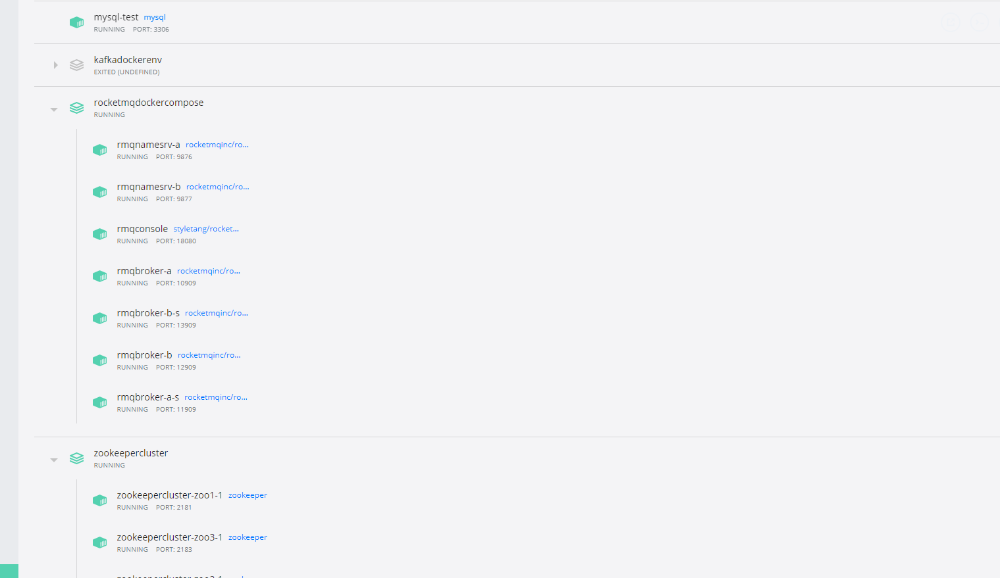

# 使用本地单机 Docker 搭建环境

## 我本地搭建成功的

### 涉及Container 清单
1. Zookeeper 集群
2. RocketMq 双主双从集群包括管理工具
3. Dubbo 管理工具
4. 一个单机Mysql 这里不用compose 因为只有一个， 如果你本地已经装了，可以选择忽略我说的

## 更改配置文件
打开所有的配置文件，只要有这个IP地址的地方  10.22.18.152  
替换成你本地的IP地址，ipconfig 或者 ifconfig 出来的默认外网地址，切记不要用 127.0.0.1

涉及数据库用户名密码改成你自己的， 我的是root/123456

## 启动docker 容器
然后三个 compose.yml 文件都执行 docker-compose up -d 

